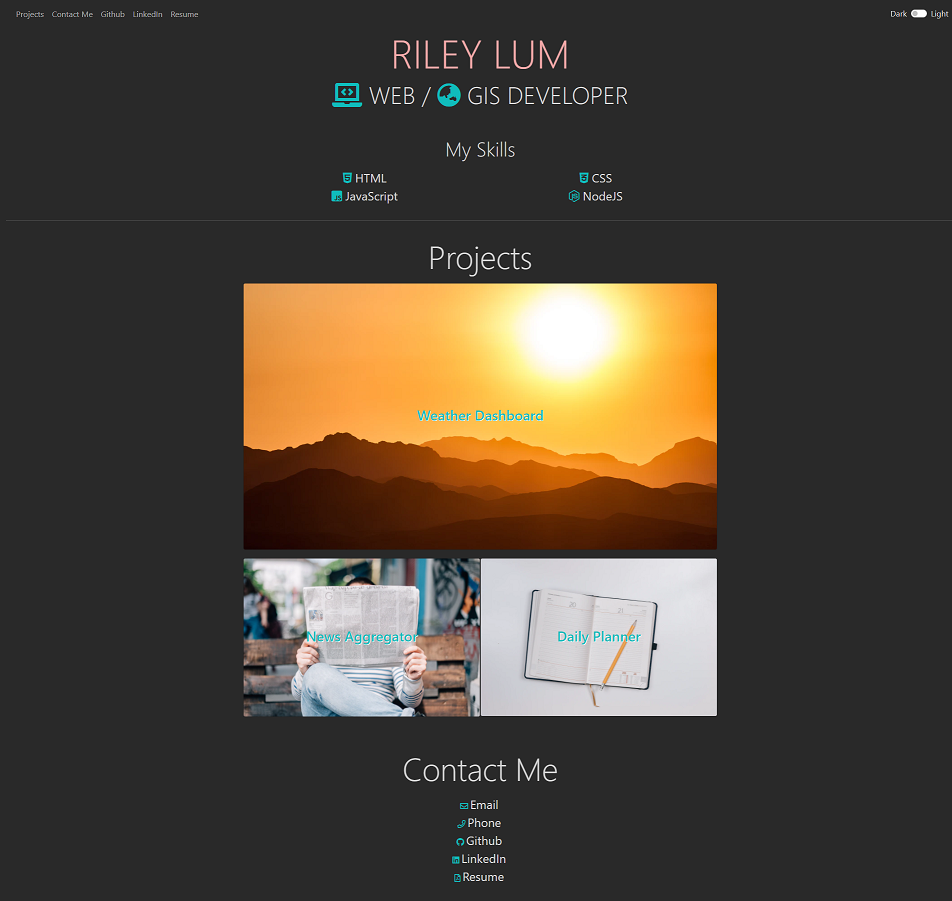

#Personal Portfolio

##Description

A website to showcase my personal projects and my contact information. 

This website is built using HTML, CSS, Bootstrap and JS.

The website can be accessed here: https://rileylum.github.io/Riley-Lum-Portfolio/

##Credits

I used:
- Bootstrap for the styling, which can be found here: https://getbootstrap.com/
- Font Awesome for the icons, which can be found here: https://fontawesome.com/
- Unsplashed for the stock images, which can be found here: https://unsplash.com/
  * Sunrise Photo for Weather Dashboard was provided by: https://unsplash.com/@grin
  * Newspaper Photo for News Aggregator was provided by: https://unsplash.com/@romankraft
  * Dairy Photo for Daily Planner was provided by: https://unsplash.com/@jeshoots
- Coolors for deciding on and creating a colour palette, which can be found here: https://coolors.co/ 
